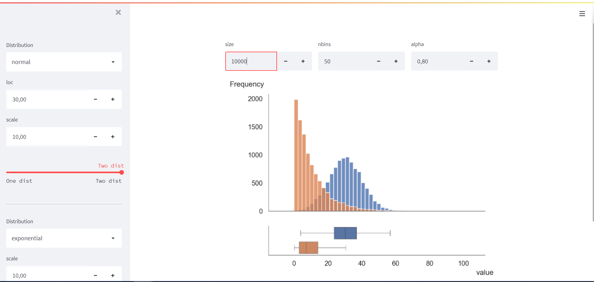

## A Random Distribution Visualizer
A way to visualize and compare one or two random distributions. Just to check the viability of <a href='https://docs.streamlit.io/'>streamlit</a> for other applications.

Pretty neat!

## How to run

* Clone the repository

* `pip install -r requirements.txt`

* `streamlit run compare_dists.py`